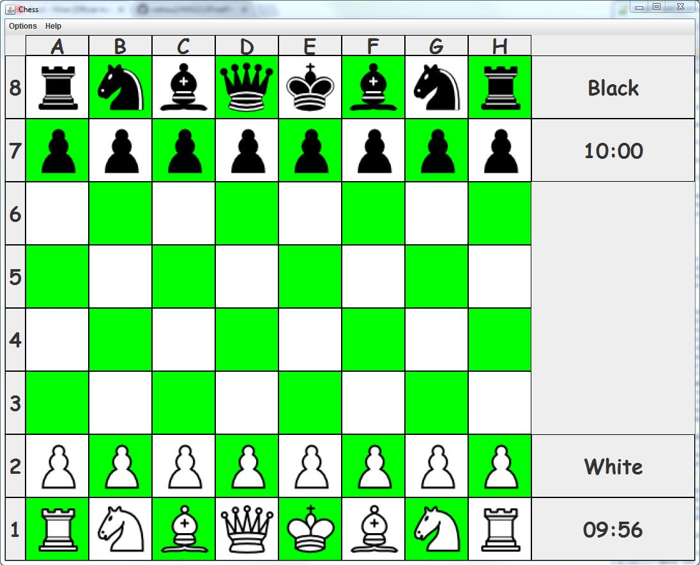

# **GUI Chess**
#### By Jerry Sun and Weiwen Zhou Pd 9

# Instructions

The basic goal of Chess is to capture the enemy's king. Each piece has a different set of possible
moves that allow players to play strategically. It's no wonder Chess has become a popular worldwide
strategy game. For a more in-depth guide, please click [here](http://www.chesscorner.com/tutorial/learn.htm).

# How To Play
1. a

# Features

- a

# To Be Added

# DevLog

